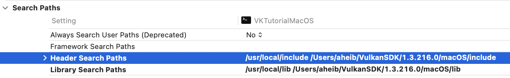
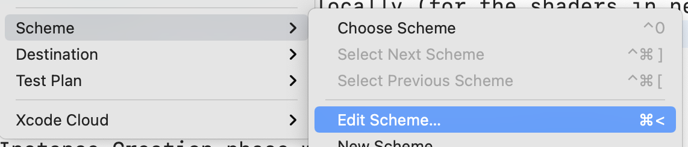
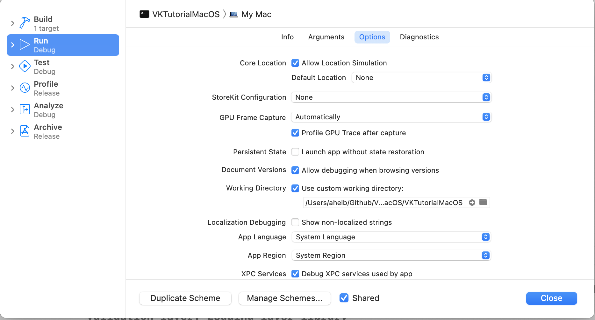

# VKTutorialMacOS

[vulkan-tutorial.com](https://vulkan-tutorial.com/Introduction)

This tutorial is just a bugfix to the Vulkan Tutorial Introduction for MacOSX.   
I went through some challenges on the library and include path setups.    
And mostly some issues regarding Instance and Device specific parameters for MacOSX.   

##  1. Development Environment

1.1. Download and install Vulkan SDK from https://vulkan.lunarg.com/
[vulkansdk-macos-1.3.216.0.dmg](https://sdk.lunarg.com/sdk/download/1.3.216.0/mac/vulkansdk-macos-1.3.216.0.dmg)

Choose a location to install the SDK, for ex: ~/VulkanSDK.
Edit your environment file 'sudo vi ~/.zshrc', adding new VULKAN environment variables:

```
# Vulkan
export VULKAN_SDK="~/VulkanSDK/1.3.216.0/macOS"
export DYLD_LIBRARY_PATH="$VULKAN_SDK/lib:${DYLD_LIBRARY_PATH:-}"
export VK_ADD_LAYER_PATH="$VULKAN_SDK/share/vulkan/explicit_layer.d"
export VK_ICD_FILENAMES="$VULKAN_SDK/share/vulkan/icd.d/MoltenVK_icd.json"
export VK_DRIVER_FILES="$VULKAN_SDK/share/vulkan/icd.d/MoltenVK_icd.json"

export PATH=$PATH:$VULKAN_SDK/bin
```

1.2. Install the addition libraries

```
$ brew install glfw
$ brew install glm
```
 
1.3. Create a new XCode Console project using C++

Go through the Vulkan Tutorial Development https://vulkan-tutorial.com/Development_environment, which is very well done.

Only trick is to make sure when you add Header Search Paths to add /usr/local/include top and then (VUKLAN_SDK path)/include next.   
Same for Library Search Path to add /usr/local/lib top and then (VUKLAN_SDK path)/lib next.   


Prepare the Scheme to load file locally (for the shaders in next steps).   


And then tick the use custom directory, don't forget to set the path. 



## 2. MACOSX Specific Code

On the Instance Creation phase we need to ensure that these 2 extensions are present:   
```
        // MACOSX Specific Code
        extensions.emplace_back(VK_KHR_PORTABILITY_ENUMERATION_EXTENSION_NAME);
        extensions.emplace_back(VK_KHR_GET_PHYSICAL_DEVICE_PROPERTIES_2_EXTENSION_NAME);
        createInfo.flags |= VK_INSTANCE_CREATE_ENUMERATE_PORTABILITY_BIT_KHR;
```

On the Device Extensions, we need to check for an add'l extension call  "VK_KHR_portability_subset":   

```
// MACOSX Specific Code
const std::vector<const char*> deviceExtensions = {
    "VK_KHR_swapchain",
    "VK_KHR_portability_subset"
};
```
